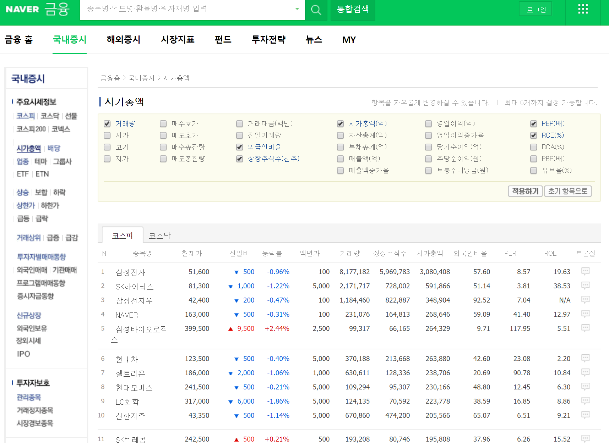

```{r setup, include=FALSE}
knitr::opts_chunk$set(
	echo = TRUE,
	message = FALSE,
	warning = FALSE,
	fig.width = 9, fig.height = 5, dpi = 144
)
```

# 서론 

> 텍스트마이닝은 전통적인 질적 연구기법에 적합하지 않은 대규모 데이터 셋을 분석하고 이해하는 데 널리 사용되는 방법

---

## KOSPI200 예제 데이터 

> 국내의 KOSPI200 데이터를 웹 크롤링(web상에 존재하는 콘텐츠를 수집하는 작업)  
˜
국내 KOSPI200 데이터의 순위 50위권 주식 종목 명, 시가총액을 가져오도록 한다.



---

